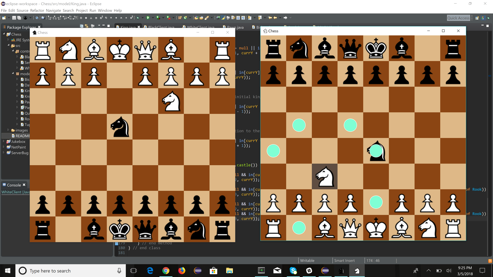

# Chess-Game
Chess game developed using javafx for graphical interface. This game also utilizes
networking, although currently this is by default over the local host. However, there
are two client classes that run based off of the server, which contains the model of the
actual chess board. When a move is made, this move is sent to the server, and then updated
in both clients, updating the GUI accordingly with every move that is transmitted or made.
These moves are restricted, as well as highlighted on screen when the user selects a piece
to move.

Similarly, this game also allows castling to be done, which can be seen in the following
images. 

Finally, this game also tracks when a king is in check, which is highlighted on both
screens when this happens, as can be seen in this final image. 

This program is currently an Eclipse project. To run this, clone and create a workspace, 
then run the server initially before running the white and black clients. The game will
also track who's turn it is, and only allow for the corresponding pieces to be moved in
each client, meaning white can only move white and vice versa for black.  
Chess piece icons courtesy of https://marcelk.net/chess/pieces/
